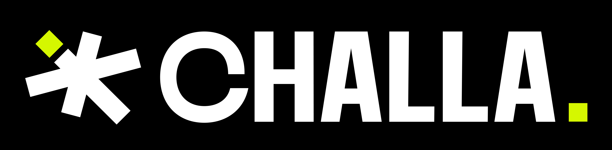
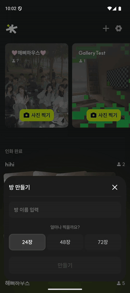
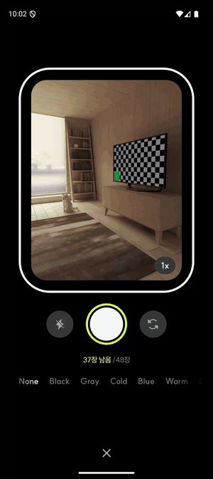
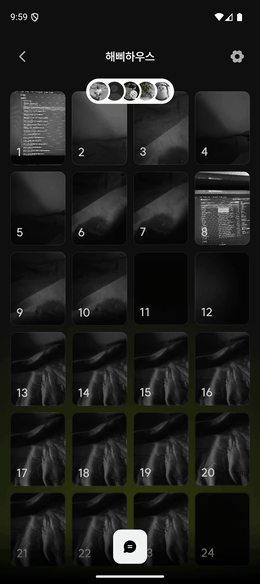
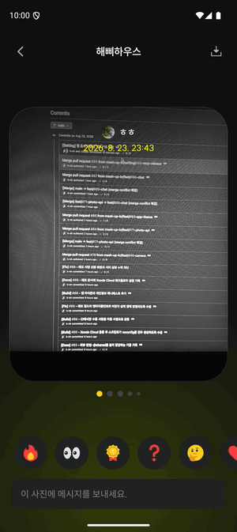
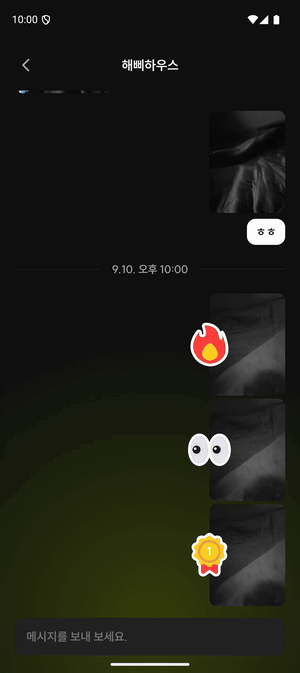
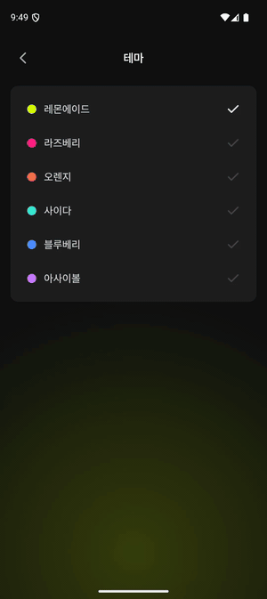
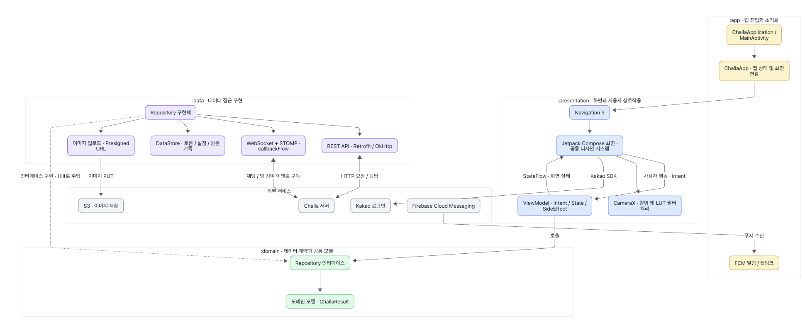

<div align="center">



# CHALLA · 찰나

**함께 찍고, 함께 기다리는 우리만의 찰나**

하나의 필름을 함께 채우며, 서로의 시선으로 순간을 기록하는 **공유 필름 카메라**

<br/>


[](https://github.com/mash-up-kr/challa-Android/actions/workflows/ci.yml)
[](LICENSE)

</div>

<br/>

## ABOUT

필름 한 통을 나눠 쓰던 일회용 카메라처럼, 친구들과 **하나의 필름을 함께 채웁니다.**

찍은 사진은 바로 볼 수 없어요. 촬영을 마치고 인화를 기다려야 비로소 필름이 열립니다.

같은 시간을 각자의 시선으로 담아낸 사진들이, 그때서야 한꺼번에 도착해요.

|                          01                           |                              02                              |                             03                             |
| :---------------------------------------------------: | :----------------------------------------------------------: | :--------------------------------------------------------: |
|                  🎞️<br/>**함께 채우는 필름**                  |                 ⏳<br/>**기다림으로 깊어지는 회상**                 |                💬<br/>**사진으로 이어지는 이야기**                |
| 친구를 초대해 24 / 48 / 72장 중<br/>하나의 필름을 함께 촬영해요 | 촬영을 마친 뒤 잠시 기다리고,<br/>그날의 순간을 서로의 시선으로 다시 마주해요 | 인화된 사진에 이모지를 남기고,<br/>채팅으로 함께한 순간을 이야기해요 |

<br/>

## DOWNLOAD


<br/>

## CONTRIBUTORS

|                     함범준 🎬<br/>([@HamBeomJoon](https://github.com/HamBeomJoon))<br/>**Android Lead**                     |                     김주환<br/>([@juhwankim-dev](https://github.com/juhwankim-dev))                      |                      김아린<br/>([@arinming](https://github.com/arinming))                       |
| :---------------------------------------------------------------------------------------------------------: | :-----------------------------------------------------------------------------------------------------: | :---------------------------------------------------------------------------------------------: |
|                                     |                                |                             |
|              `카메라, 이미지 처리`<br/>`디자인 시스템`<br/>`실시간 통신(채팅, 방 참여 알림)`<br/>`설정`               |                 `홈`<br/>`로그인`<br/>`프로필`<br/>`방 설정`                  |                `갤러리`<br/>`사진 상세`<br/>`방 커버`                 |

<br/>

## DEMO

|                            방 만들기                            |                          촬영 · 필름 필터                          |                            필름 공개                             |
| :-------------------------------------------------------------: | :----------------------------------------------------------------: | :--------------------------------------------------------------: |
|        |         |      |
|   이름을 짓고 24 / 48 / 72장 중<br/>함께 채울 필름을 골라요   |    찍기 전에 필름 톤을 고르고,<br/>남은 장수만큼만 촬영해요    |    인화가 끝난 방에서<br/>모두의 사진이 한 번에 열려요     |

|                          사진 상세 · 이모지                          |                          사진별 채팅                           |                              테마                              |
| :------------------------------------------------------------------: | :------------------------------------------------------------: | :------------------------------------------------------------: |
|          |       |     |
|       넘겨 보며 사진마다<br/>이모지로 반응을 남겨요        |    남긴 반응과 메시지가<br/>실시간으로 이어져요     |     여섯 가지 색으로<br/>앱 분위기를 바꿔요      |

<br/>

## ARCHITECTURE



| 모듈 | 역할 |
| --- | --- |
| **app** | Application, DI 진입점, 딥링크, 알림, 빌드 설정 |
| **presentation** | Compose UI, MVI(State / Intent / SideEffect), 디자인 시스템 |
| **domain** | 순수 Kotlin. 모델 · Repository 인터페이스 · `ChallaResult` |
| **data** | Retrofit API, DTO, WebSocket, Repository 구현, DataStore |

- `domain`은 **안드로이드 의존성이 없는 순수 Kotlin 모듈**이라 JVM 단독 테스트가 가능합니다
- `presentation`은 MVI(UDF)를 따릅니다. 상태는 단일 immutable `UiState`, 이벤트는 `UiIntent`, 일회성 알림은 `UiSideEffect`로 흐릅니다
- 데이터는 `~Response` → `Domain 모델` → `~UiModel` → `UiState` 순으로 변환됩니다
- 화면 이동은 Navigation 3(`NavDisplay` · `NavKey`) 기반의 `ChallaNavigator`를 거칩니다

<br/>

## MODULE & PACKAGE CONVENTION

```
🗃️ app
 ┣ 📂 deeplink
 ┣ 📂 di
 ┣ 📂 logging
 ┣ 📂 notification
 ┗ 📂 ui

🗃️ presentation
 ┣ 📂 base            # BaseViewModel, UiState / UiIntent / UiSideEffect
 ┣ 📂 designsystem
 ┃ ┣ 📂 foundation    # color, typography, icon, motion, layout
 ┃ ┣ 📂 component
 ┃ ┣ 📂 theme
 ┃ ┗ 📂 preview
 ┣ 📂 navigation      # ChallaRoute, ChallaNavHost, ChallaNavigator
 ┗ 📂 기능 별 패키징   # home, camera, gallery, photodetail, chatting ...
    ┣ 📂 contract     # State / Intent / SideEffect
    ┣ 📂 component
    ┗ 📂 model        # 화면 전용 UiModel

🗃️ domain
 ┣ 📂 event
 ┣ 📂 model
 ┣ 📂 repository
 ┗ 📂 result          # ChallaResult

🗃️ data
 ┣ 📂 di
 ┣ 📂 image
 ┣ 📂 local
 ┣ 📂 network
 ┃ ┣ 📂 api
 ┃ ┣ 📂 adapter
 ┃ ┣ 📂 dto
 ┃ ┃ ┣ 📂 request
 ┃ ┃ ┗ 📂 response
 ┃ ┣ 📂 interceptor
 ┃ ┣ 📂 qualifier
 ┃ ┗ 📂 websocket
 ┗ 📂 repository
```

<br/>

## TECH STACK

| 분류 | 기술 스택 |
| --- | --- |
| **UI & Architecture** | Kotlin · Compose · Navigation 3 · ViewModel · Hilt · Multi-module |
| **Data & Async** | Coroutines · Flow · Retrofit · OkHttp · Serialization · DataStore |
| **Real-time** | WebSocket · STOMP |
| **Camera & Image** | CameraX · 3D LUT · RuntimeShader · Coil · S3 |
| **Service & Quality** | Kakao SDK · FCM · GitHub Actions · ktlint |

<br/>

## GETTING STARTED

```bash
git clone https://github.com/mash-up-kr/challa-Android.git
./gradlew build
```


```bash
./gradlew ktlintCheck   # 린트 검사 (커밋 전 필수)
./gradlew ktlintFormat  # 자동 포맷
./gradlew :domain:test  # domain 단위 테스트
```

<br/>

## BRANCH STRATEGY

GitFlow를 따르고, 브랜치 프리픽스는 **GitHub 이슈 라벨**을 따릅니다.

```
{프리픽스}/#{이슈번호}-{상세기능}
```

| 라벨 | 프리픽스 | 예시 |
| --- | --- | --- |
| ✨ Feature | `feat` | `feat/#130-room-cover-image` |
| 🔨 Refactor | `refactor` | `refactor/#134-2nd-UT-High` |
| 🐞 BugFix | `fix` | `fix/#118-photo-detail-crash` |
| ✅ Test | `test` | `test/filter_sample` |
| 🌏 Deploy | `deploy` | `deploy/#139-proguard` |
| ⚙ Setting | `setting` | `setting/#145-readme` |
